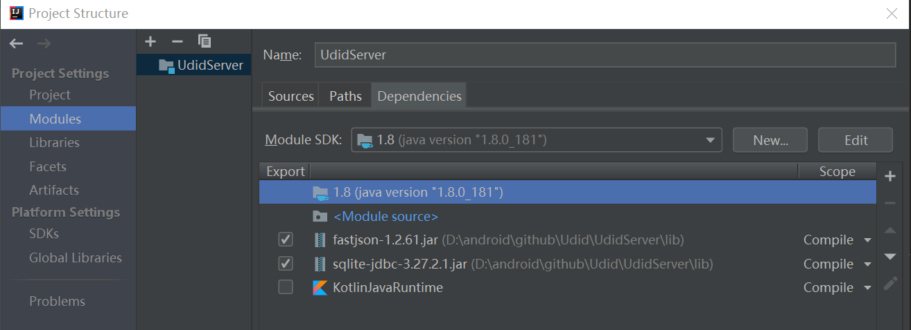

## UDID

本项目提供一种Android移动设备构造UDID的方案。
项目分为两个目录，UdidClient和UdidServer。

## 使用方法

客户端和服务端分别在Android Studio和Intellij IDEA上开发，在对应的IDE上运行即可。

服务端代码，服务监听用的JDK自带的HttpServer，数据库用的sqlite-jdbc。
可能需要到 Project Structure 配置一下依赖。
如图：


客户端代码，需要先修改URLConfig的地址:

```kotlin
object URLConfig{
    const val DEVICE_ID_SERVER = "http://192.168.0.113:8080"
}
```

## 相关链接
https://juejin.im/post/5d8ab56df265da5bb252d67c


## License
See the [LICENSE](LICENSE.md) file for license rights and limitations.
